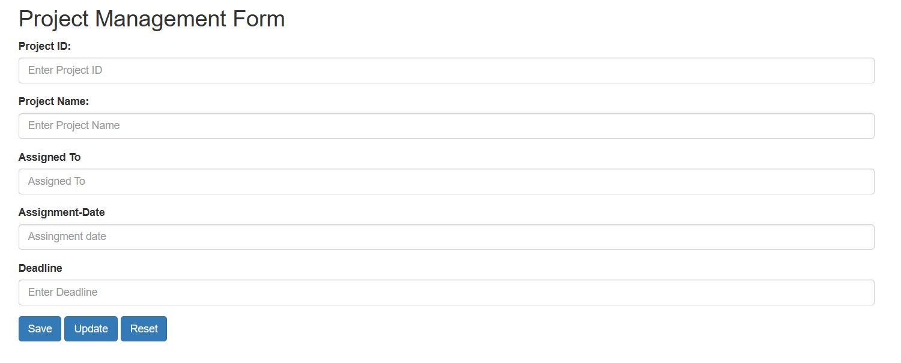

# Title of the Project: Project Management Form

# Description

Project Management Form that will store data in PROJECT-TABLE relation of COLLEGE-DB database

Input Fields: {Project-ID, Project-Name, Assigned-To, Assignment-Date, Deadline}

Primary key: Project ID

1. Step -1 : Create a form based on any one of the TOPICS given below. The form should store data in the database. The primary key and input fields of each topic is mentioned.

2. Step -2 : There will be three control buttons [Save], [Update] and [Reset] at the bottom of the form. On page load or any control button click, an empty form will be displayed and the cursor will remain at the first input field in the form which will have the primary key in the relation. All other fields and buttons should be disabled at this time.

3. Step -3 : User will enter data in the field having primary key and

* If the primary key value does NOT exist in the database, enable [Save] and [Reset] buttons and move the cursor to the next field and allow the user to enter data in the form.

* Check that the data should be valid i.e. no empty fields.

* Complete the data entry form and click the [Save] button to store the data in the database and go to step-2.

* If the primary key value is present in the database, display that data in the form. Enable [Update] and [Reset] buttons and move the cursor to the next' field in the form. Keep the primary key field disabled and allow users to change other form fields.

* Check that the data should be valid i.e. no empty fields.

* Click on [Update] button to update the data in the database and go to step-2.

* Click [Reset] to reset the form as per the step-2.

# Benefits of using JsonPowerDB

1. JsonPowerDB (JPDB) is a cutting-edge, disruptive, multi-mode DBMS with a number of USPs.
2. A proprietary algorithm for CRUD operations with high performance. Several times quicker than well-known DBMS.
3. Serverless support for quicker development - A complete dynamic application may be developed by a UI developer.
4. The speed of DBMS with integrated web / application server and embedded cache is lightning fast.
5. The best query performance is provided by server side Native NoSQL.
6. Built-in ability to query across many JPDB databases.
7. Support for Document DB, Key-Value DB, and RDBMS in a multi-mode DBMS.
8. Easy to develop and maintain and without a schema.
9. HTTP-compatible programming languages can use the web-services API.
10. Improved with a framework that supports pluggable APIs - A developer can create a pluggable API and add it to any of our cloud JPDB instances.
11. The development process is made simple, more readable, and less error prone through the standardisation of API development framework.
12. Multiple levels of security.
